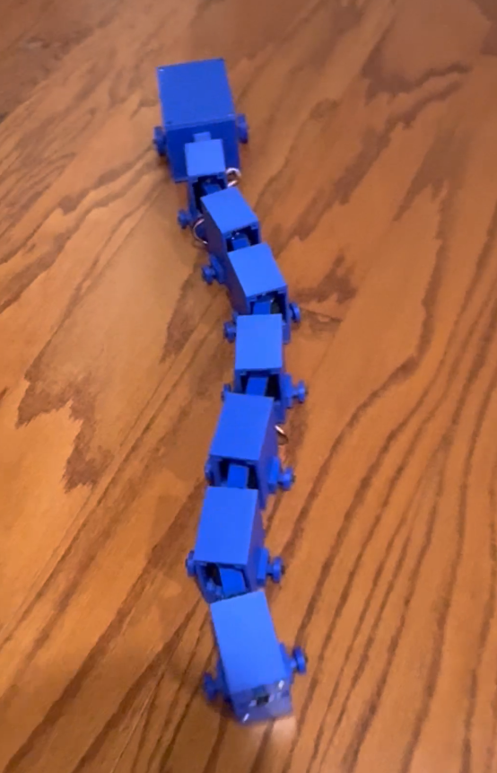
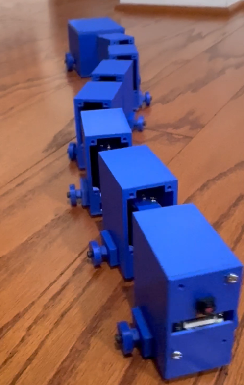
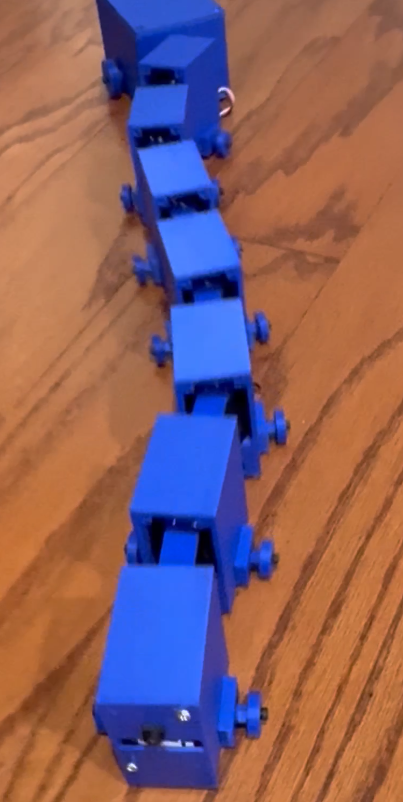
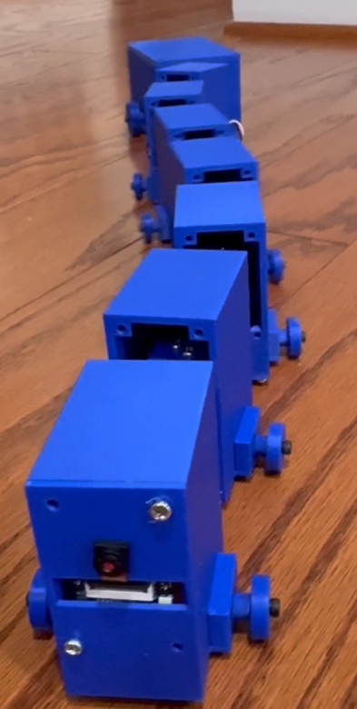
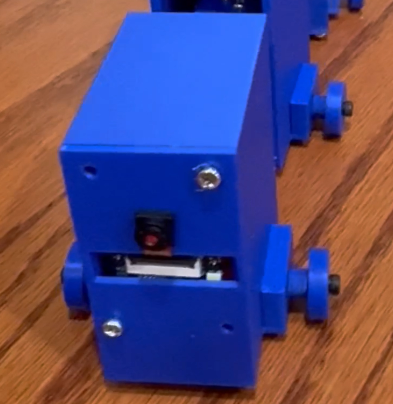
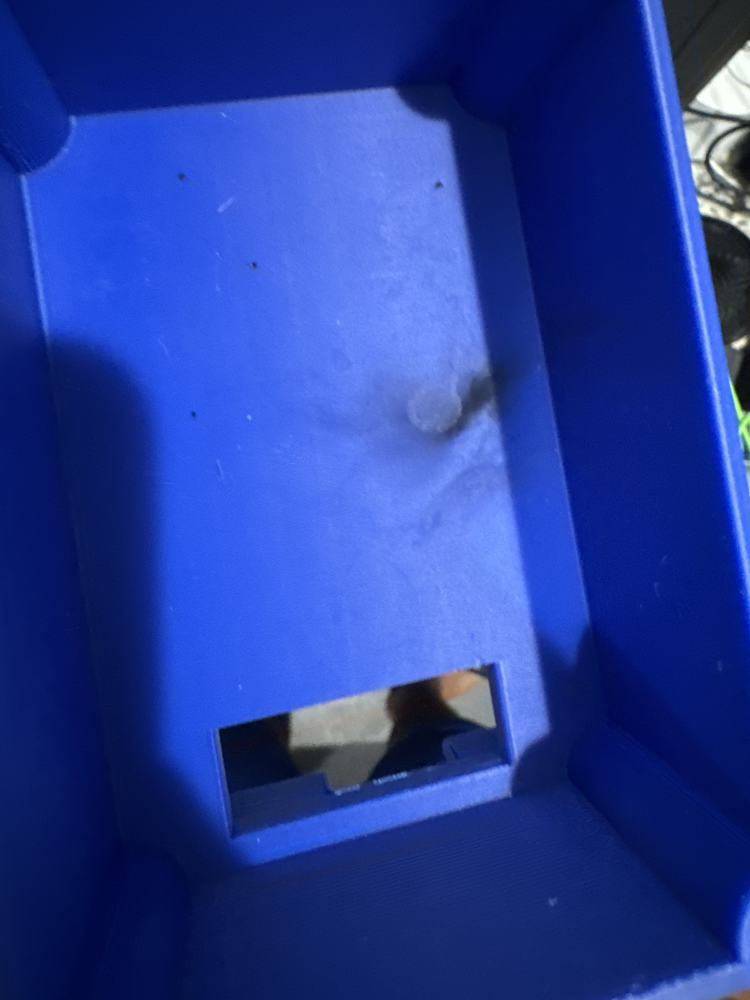

# Teleoperated Snake Robot

A six-segment serpentine robot built with the intention to aid in search and rescue efforts where people or other robots cannot help. It is fully untethered, controlled over Bluetooth from an Xbox controller, and has a forward-facing camera.

I chose this form factor because I thought snake robots would be better suited for confined-space inspection where wheeled or legged robots can't fit. This is a testbed for that mechanism, not a deployable system.



[Robot Demo](https://youtube.com/shorts/Uw1LnG1LLQQ?feature=share)

## What it does

- Travels forward on flat hard surfaces with a sinusoidal traveling-wave gait
- Steers through a graded joint offset that arcs the body, though turning is weak
- Streams video from an ESP32-CAM

## Hardware

- **Servos** - 6× Feetech STS3215 serial bus servos
- **Main controller** - ESP32-WROVER
- **Servo interface** - Waveshare serial bus servo driver board
- **Camera** - ESP32-CAM
- **Power** - 2S 7.4V LiPo, 1500mAh, with LM2596 buck converters to step down voltage for ESP32s
- **Control** - Xbox controller over Bluetooth via Bluepad32
- **Structure** - 3D-printed PLA shells

## How it works

Six servos are chained on a single TTL bus. Each servo sets the angle between two adjacent shells, so the robot has no absolute heading control — only relative joint angles. Forward motion comes from propagating a sine wave down the body:

```
target[i] = center + amplitude × sin(2π·f·t + i·φ)
```

with a phase offset of `φ = 2π/N`, producing one full wave along the body.

 |  | 

Steering applies a per-joint offset that biases the wave's center, bending the body into an arc that the wave then travels along.

## Problems

### Serpentine Gait
I learned a serpentine gait requires more friction when moving horizontally than forward/back through a series of attempts and design changes.

**1. Printed rails:** Longitudinal PLA rails on each segment's bottom. This didn't really change the friction in any way, so it was pretty much the same as just sliding on the raw shell bottom.

**2. Rubber pads:** I glued rubber strips along the rails, since I thought more grip would mean more thrust. I didn't realize that this also meant more friction forwards, as well as horizontally. The high amount of friction in both directions caused the segment to buckle and go upwards.

**3: Passive wheels.** I replaced the shell's bottom with passive wheels that rotate when going forward, but drag when going horizontally. This decreased the forward friction, generating more thrust in the serpentine gait.



### Turning

Turning is weak and the robot cannot pivot in place. I spent a long time on this, but with my current design, it wasn't possible to improve turning without sacrificing forward thrust.

**A statically bent body produces no yaw.** My first instinct was to hold one joint at an angle as a rudder. A frozen joint does no work against the ground, so it produces no torque. Only moving joints generate forces, and symmetric motion cancels to zero yaw over a cycle.

**The wheels work against turning.** They resist lateral sliding, which is what makes forward motion work. But turning requires the body to rotate, and rotation means sliding sideways — so the thing that fixed my forward speed cost me turning authority.

**The uniform offset works, but barely.** Bending the whole body into an arc and letting the wave travel along it produces some rotation, but not much. With ±17.58 degrees of joint range, total body curvature maxes out around 105 degrees, with high offsets stalling the robot, and low ones not turning much.

### Destroyed Parts

An early ESP32-WROVER died to current transients from servo stalls conducted through a shared ground wire. Also, a short circuit occurred due to a badly soldered wire for the input voltage pin of the buck converter inside of the electronics box. This short circuit caused a small explosion in the box, and cooked the second ESP32-WROVER, a Waveshare Serial Bus Servo Driver Board, and my buck converter.



### Heavy Electronics Box
The battery, driver board, buck converter, and ESP32 are too large to fit inside the standard segment design, so they are in a towed box connected by a passive joint. At first, I used the same rail design I had used for my regular segments, but this didn't allow the box to move well, weighing the entire robot down and making it unable to move. Then, I used forward facing wheels I used on the regular segments. This allows the box to move much easier than before, allowing the rest of the robot to move as well.